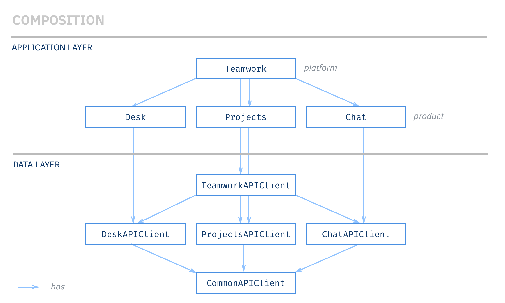
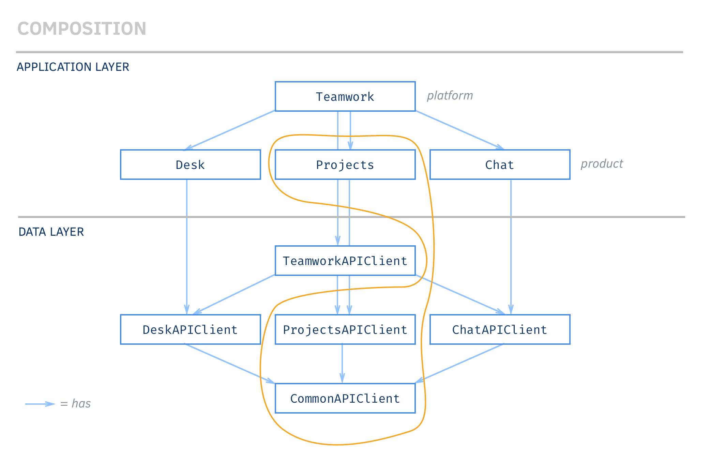
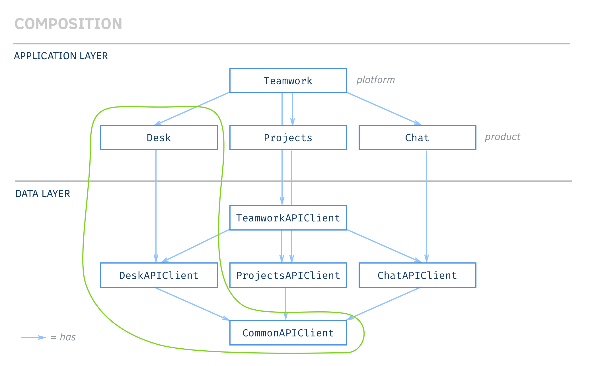
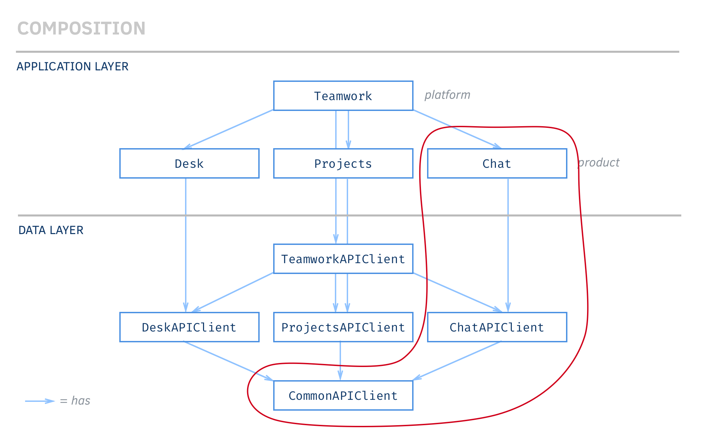

# Structure of the API
With the considerable complexity of condensing all three Teamwork Products into a single API comes a moderately complex code structure. This Teamwork API uses composition of objects to enable using all Products or using only a single Product.

## Composition
The composition of the entire `Teamwork` top down is as follows:

The reason for the following composition is to allow us to use each product in a standalone manner. See the following diagrams (forgive the crazy lassos):

If it helps, here's an attempt at putting it in plain english:

> `Teamwork` *has* each product (`Projects`, `Desk`, `Chat`) and a `TeamworkAPIClient`. Each product has it's own API client (`(Projects|Desk|Chat)APIClient`) which is provided by the `TeamworkAPIClient` from `Teamwork` (which has each product's `(Projects|Desk|Chat)APIClient`).